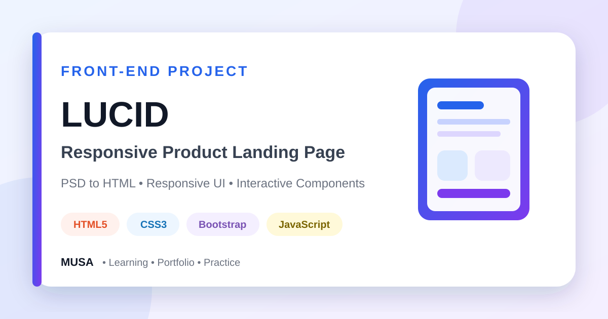

<div align="center">



# Lucid — Responsive Product Landing Page

### A polished PSD-to-HTML product landing page with responsive sections, pricing, testimonials, contact content, and interactive UI components.


[](https://github.com/samusa099)
[](https://developer.mozilla.org/docs/Web/HTML)
[](https://developer.mozilla.org/docs/Web/CSS)
[](https://getbootstrap.com/)
[](https://developer.mozilla.org/docs/Web/JavaScript)

[](https://github.com/samusa099/Assignment_10)
[](https://github.com/samusa099/Assignment_10)
[](https://github.com/samusa099/Assignment_10/commits/main)

</div>

---

## 📌 Overview

This repository demonstrates practical PSD-to-HTML conversion, Bootstrap layout, responsive design, carousel integration, reusable sections, and organised front-end assets.

## 📚 Documentation

| Resource | Description |
|---|---|
| [**HOW_TO_USE.md**](HOW_TO_USE.md) | Detailed explanation of why, where, and how to use, customise, study, and reuse the project |
| [**Repository Cover**](assets/repository-cover.svg) | Scalable professional SVG cover used at the top of this README |

## ✨ Key Features

- Responsive navigation and hero presentation
- Product feature and device showcase sections
- Customer testimonial carousel
- Pricing cards and calls to action
- Contact section with embedded map
- Custom breakpoints and reusable styling

## 🛠️ Technology Stack

| Technology | Purpose |
|---|---|
| HTML5 | Page structure and semantic content |
| CSS3 | Layout, styling, and responsiveness |
| Bootstrap 5 | Grid, utilities, and UI components |
| JavaScript and jQuery | Browser interactions and plugin integration |
| Owl Carousel | Responsive carousel behaviour |
| Font Awesome | Interface and social icons |

## 🗂️ Repository Structure

```text
Assignment_10/
├── index.html
├── css/
├── js/
├── images/
├── assets/
│   └── repository-cover.svg
├── HOW_TO_USE.md
└── README.md
```

## 🚀 Run Locally

```bash
git clone https://github.com/samusa099/Assignment_10.git
cd Assignment_10
```

Open `index.html` in a browser or launch it with **VS Code Live Server**.

> The forms and calls to action are static demonstrations until connected to backend services.

## 👤 Author

<div align="center">

### Musa

**Internationally certified HR professional and data analytics practitioner from Bangladesh.**  
Musa combines people operations, Excel, Power BI, SQL, and technology-driven problem-solving to build practical, structured, and user-focused projects.

[](https://github.com/samusa099)

</div>
